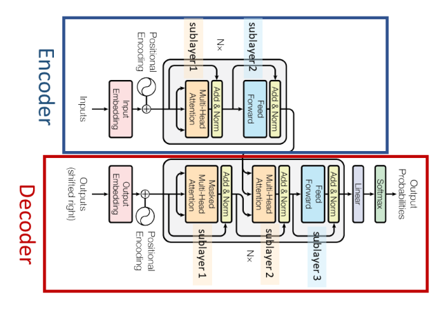
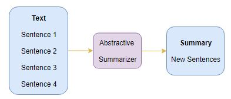

# Transformer-networks-for-abstractive-summarization

### Abstractive Summarization with Transformers:

Abstractive summarization is the technique of generating a summary of a text from its main ideas, not by copying verbatim most salient sentences from text. There have been many different algorithms and methods for performing this task including the use of RNNs or the newer networks: Transformers. 

### Dataset:

https://www.kaggle.com/shashichander009/inshorts-news-data

Inshorts is a news service that provides short summaries of news from around the web. This dataset contains headlines and summary of news items along with its source. This dataset includes 55k news and their summaries that I have used as inputs and labels of the model.

### Model settings:

The Encoder has for blocks of encoding and each block contains: 
1- multi-headed attention (mha) layer, dropout layer and layer normalization 2- a feed foward network (ffn), dropout layer and layer normalization
and the Decoder has the same blocks as the Encoder except that it contains 2 blocks of mha (multi-headed attention layer, dropout layer and layer normalization  ) x 2 and then, the ffn.
Drop out rate is 0.1 and the batch size is 64. The model is trained on a GTX-1070Ti, each epoch took about 100 seconds.

### Results:

### Tutorials on the Transformers:

* https://towardsdatascience.com/transformers-explained-65454c0f3fa7
* http://jalammar.github.io/illustrated-transformer/
* https://www.youtube.com/watch?v=TQQlZhbC5ps
